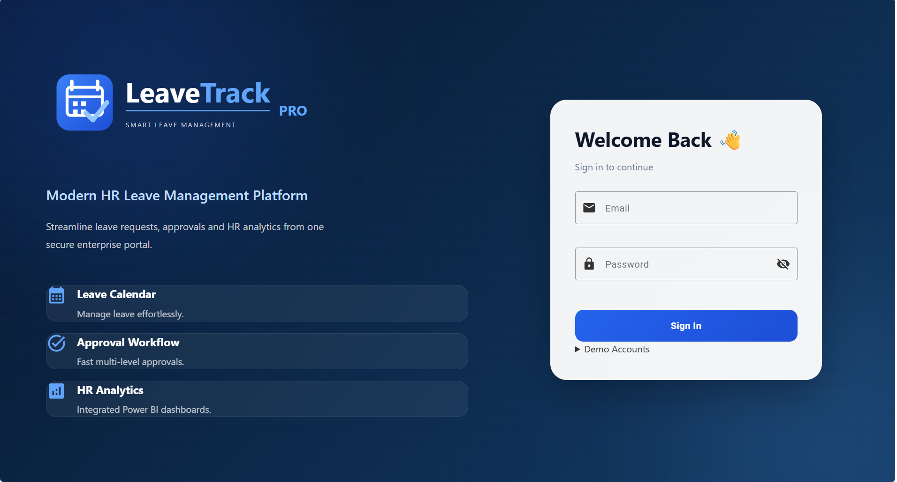
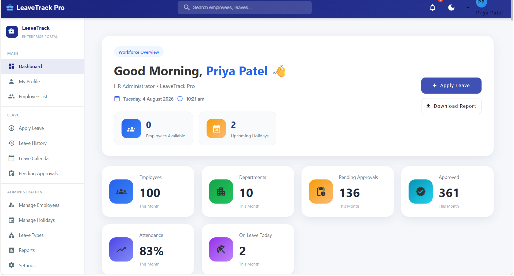
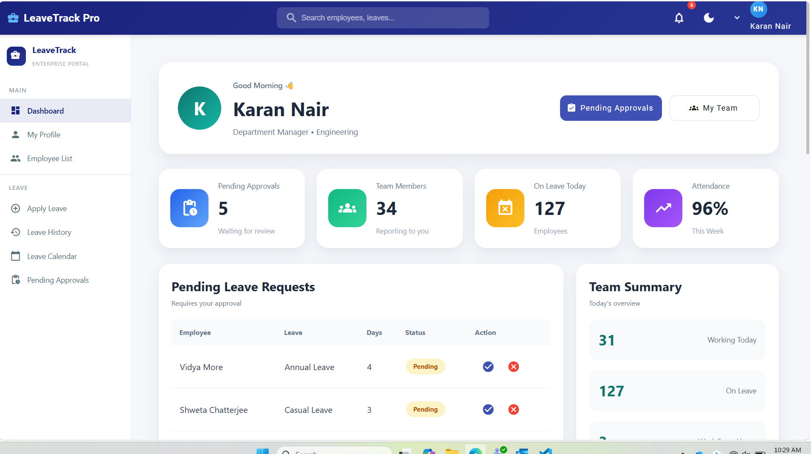
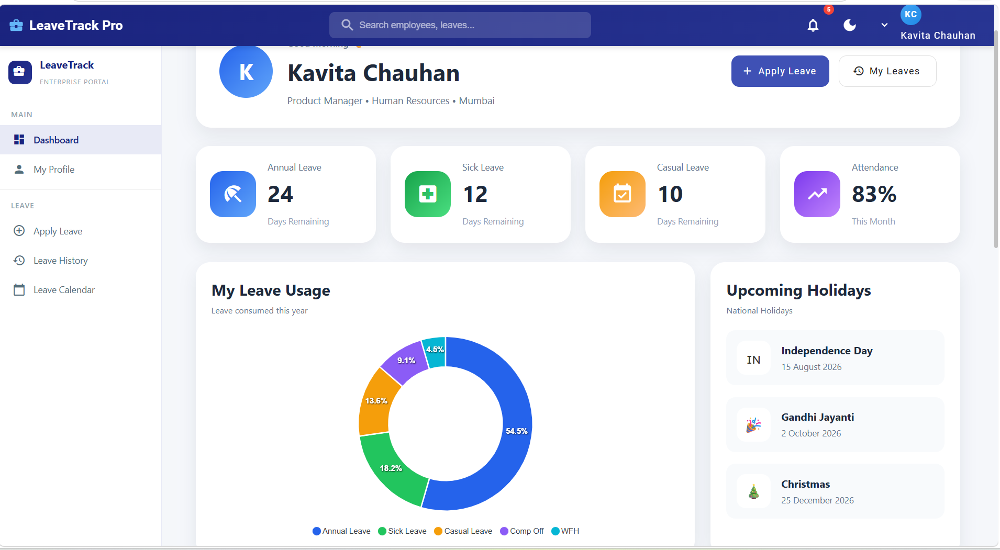
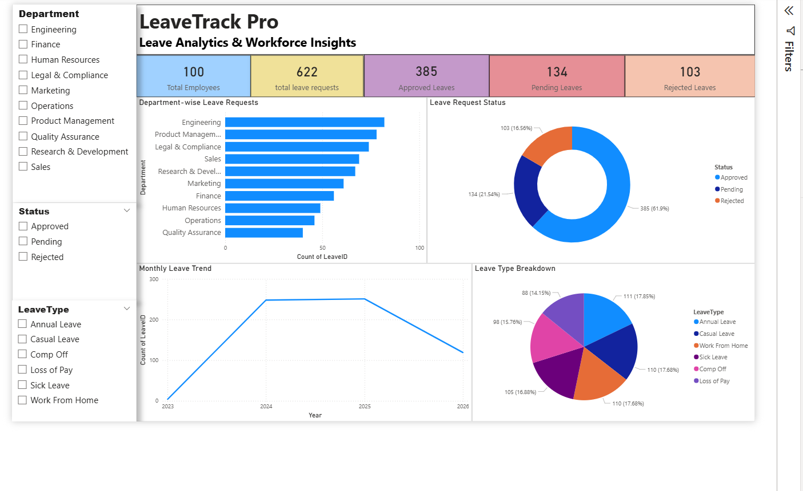

# 🚀 LeaveTrack Pro

<p align="center">
  
  
  
  
  
</p>

---

# Enterprise Leave Management System

LeaveTrack Pro is a modern enterprise Leave Management Web Application developed using **Angular 21** and **Angular Material**.

The application simulates a real-world HR Leave Management Portal with role-based authentication, employee management, manager approvals, HR administration, reporting, and Power BI analytics using realistic mock data.

---

# 🌐 Live Demo

### Angular Application

https://leavetrackpro.netlify.app/login

---

### GitHub Repository

https://github.com/MonsTech-03/leave-tracker

---

### Power BI Dashboard

*(Add your Power BI Service link here after publishing.)*

---

# ✨ Key Features

## Authentication

- Role Based Login
- Employee Login
- Manager Login
- HR Admin Login
- Route Guards
- Session Persistence

---

## Employee Module

- Apply Leave
- Leave History
- Leave Calendar
- Employee Profile
- Leave Balance
- Notifications

---

## Manager Module

- Manager Dashboard
- Team Overview
- Pending Approvals
- Approve / Reject Leave
- Team Leave Statistics
- Team Availability

---

## HR Module

- HR Dashboard
- Employee Management
- Holiday Management
- Leave Type Management
- Reports
- System Settings

---

# 📊 Dashboards

## HR Dashboard

- Employee Statistics
- Leave Trends
- Department Overview
- Recent Leave Requests
- Team Availability
- Interactive Charts

---

## Manager Dashboard

- Team Summary
- Pending Approvals
- Team Leave Requests
- Attendance Overview
- Working Today
- On Leave Employees

---

## Employee Dashboard

- Remaining Leave
- Leave History
- Upcoming Holidays
- Personal Statistics
- Recent Requests

---

# 📈 Power BI Integration

The application supports HR analytics using Microsoft Power BI.

### Workflow

```
Angular Application
        │
        ▼
Mock Employee Data
        │
        ▼
CSV Export
        │
        ▼
Power BI Desktop
        │
        ▼
Interactive Dashboard
        │
        ▼
Power BI Service
```

### Analytics Included

- Employee Leave Analysis
- Department Leave Distribution
- Leave Status Overview
- Monthly Leave Trends
- Leave Type Analysis
- Interactive Filters
- KPI Cards
- Drill Down Reports

---

# 🏗️ System Architecture

```
                  Users
                    │
                    ▼
        Angular 21 Web Application
                    │
      ┌─────────────┼─────────────┐
      ▼             ▼             ▼
 Authentication   Leave Module   Employee Module
      │             │             │
      └─────────────┼─────────────┘
                    ▼
             Mock Data Services
                    │
      ┌─────────────┼─────────────┐
      ▼                           ▼
 Angular Dashboards        CSV Export
                                  │
                                  ▼
                          Power BI Desktop
                                  │
                                  ▼
                         Power BI Service
```

---

# 🛠️ Technology Stack

| Technology | Version |
|------------|----------|
| Angular | 21 |
| TypeScript | 5.9 |
| Angular Material | 21 |
| SCSS | Latest |
| ApexCharts | Latest |
| Power BI Desktop | Latest |
| Power BI Service | Cloud |
| Netlify | Hosting |
| GitHub | Version Control |

---

# 👥 User Roles

| Role | Permissions |
|------|-------------|
| Employee | Apply Leave, View History, Calendar, Profile |
| Manager | Team Dashboard, Pending Approvals, Team Management |
| HR Admin | Employee Management, Reports, Holidays, Leave Types, Analytics |

---

# 📷 Application Screenshots

## Login Page



---

## HR Dashboard



---

## Manager Dashboard



---

## Employee Dashboard



---

## Power BI Dashboard



---

# ⚙️ Installation

```bash
git clone https://github.com/MonsTech-03/leave-tracker.git

cd leave-tracker

npm install

npm start
```

Open

```
http://localhost:4200
```

---

# 📦 Production Build

```bash
npm run build
```

Build Output

```
dist/leave-tracker/browser
```

---

# 🔮 Future Enhancements

- Azure SQL Integration
- REST API Integration
- Email Notifications
- Teams Notifications
- Power BI Embedded Analytics
- JWT Authentication
- Azure AD Login
- Employee Attendance Module
- Payroll Integration
- AI Leave Insights

---

# 👩‍💻 Developed By

**B Monica**

Software Engineering Intern Project

Bosch Global Software Technologies

---

# ⭐ Project Highlights

✅ Enterprise UI

✅ Angular 21

✅ Angular Material

✅ Role Based Authentication

✅ Employee Dashboard

✅ Manager Dashboard

✅ HR Dashboard

✅ Leave Management

✅ Power BI Analytics

✅ Responsive Design

✅ Netlify Deployment

✅ Mock Enterprise Dataset

---

## 📄 License

This project was developed for demonstration and internship purposes.
